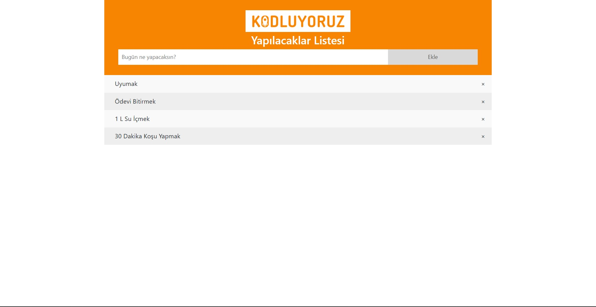
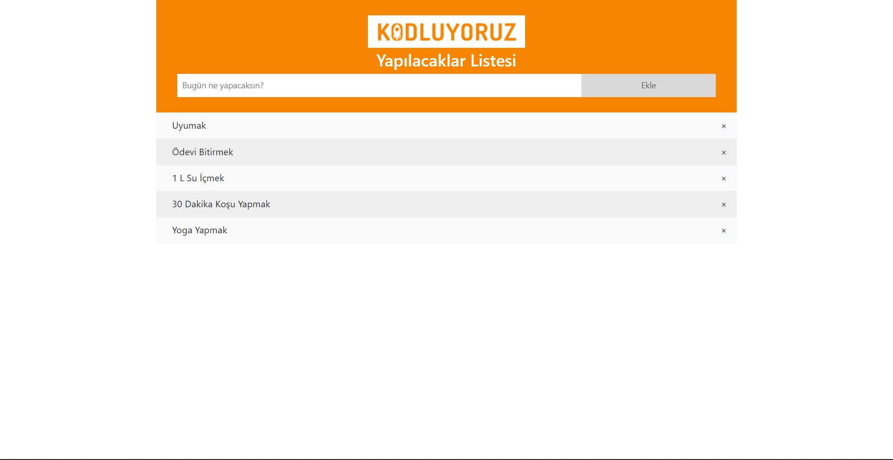
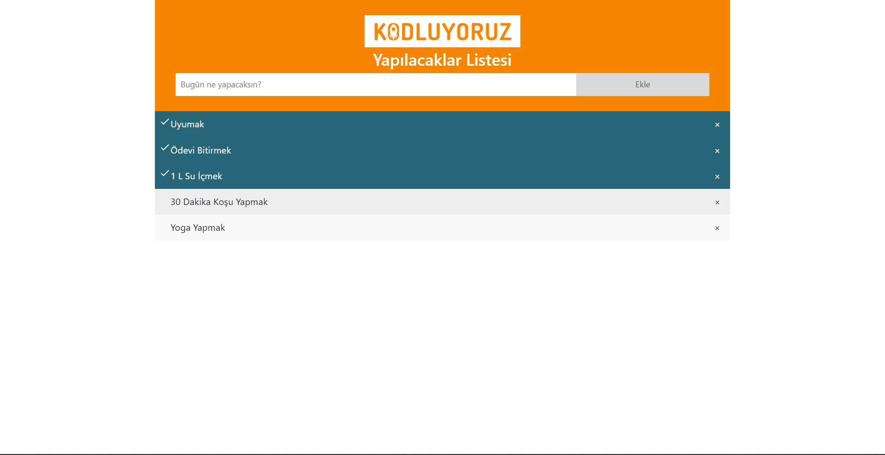
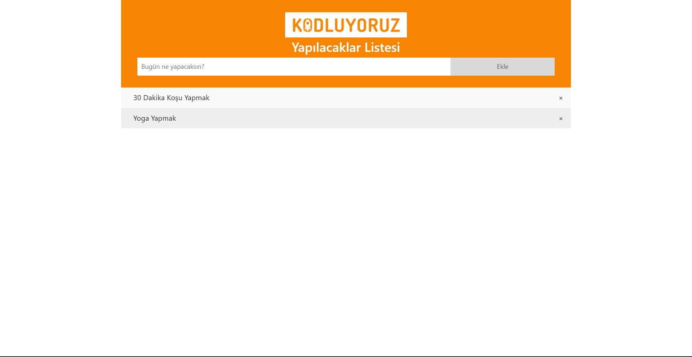

# **Netlify Link**

[**To Do List**](https://62fcea46a83b9402feb69a10--glittering-blancmange-03d3d5.netlify.app/)

# **Resimler**

**_Dört Madde Eklendi_**

**_Bir Madde Daha Eklendi_**

**_Üç Madde İşaretlendi(Yapıldı)_**

**_İşaretlenen 3 Madde Silindi_** 

***

- Madde Ekleme ✓
- Madde Silme ✓
- Yapıldı İşaretlemesi ✓
    - Üstü çizili olmamasının sebebi text-decoration özelliğinin inline-block elementlerinde çalışmamasından kaynaklanıyor bunu farkettim ama sonradan uğraşıp değiştirmek zor geldi, sorunun ne olduğu bildiğim içinde değiştirmeye gerek duymadım.

- Local Storage ✓
- Toastlar ✓
- Text içi boş ve space karakteri ile geçilmişse madde eklenmiyor ✓

